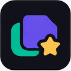
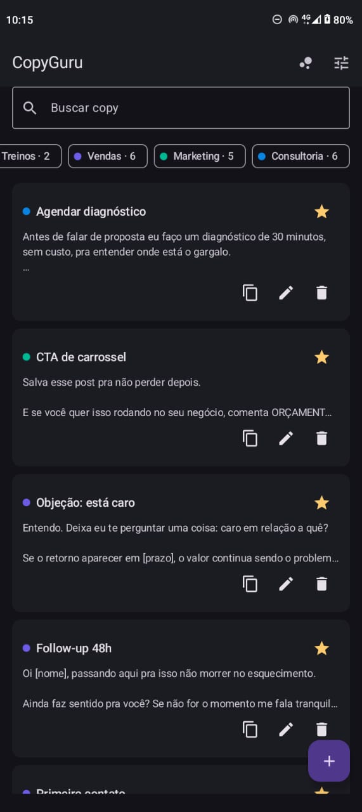
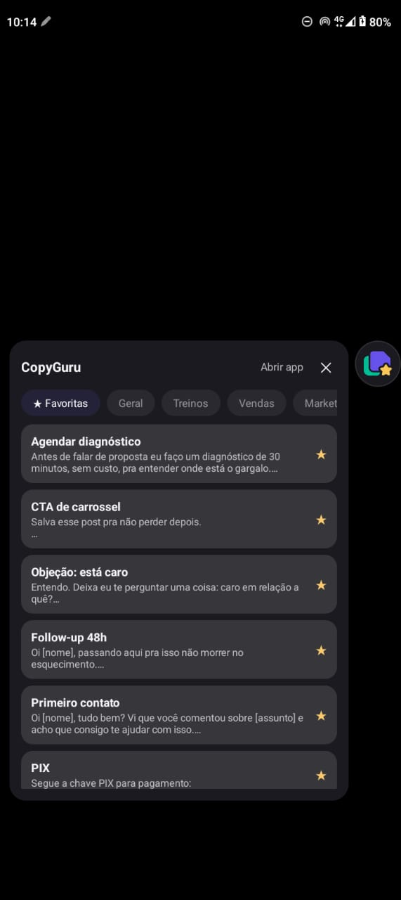

# CopyGuru

Seus textos prontos em qualquer app do celular. Uma bolinha flutuante fica por cima do que você estiver usando: toca nela, escolhe a copy, copiou. Volta pro WhatsApp e cola.

Feito pra quem manda a mesma mensagem dezenas de vezes por dia — vendedor, atendimento, consultor, freelancer.

## Telas

| Lista de copies | Bolinha flutuante |
|---|---|
|  |  |
| Segmentos coloridos com contador, favoritos no topo, busca por nome ou conteúdo | O painel abre ao lado da bolinha, nunca por cima dela. Um toque na copy manda pro clipboard |

## Como funciona

1. Você cadastra suas copies no app e separa por segmento (Vendas, Marketing, Consultoria, o que fizer sentido).
2. Liga a bolinha pelo ícone na barra superior.
3. A bolinha fica flutuando sobre qualquer app. Arrasta pra onde quiser, ela gruda na borda mais próxima.
4. Toque na bolinha abre o painel. Toque de novo fecha. Tocar fora também fecha.
5. Toque numa copy manda o texto pro clipboard. Cola onde precisar.

## Funcionalidades

- Criar, editar, favoritar e remover copies
- Segmentos com nome, cor e contador; renomear e remover
- Filtros: Todas, ★ Favoritas, ou um segmento específico
- Busca por nome ou conteúdo da copy
- Favoritas sobem pro topo da lista
- Bolinha flutuante arrastável com encaixe na borda
- Painel da bolinha com os mesmos segmentos e as favoritas
- Remover segmento avisa quantas copies vão junto antes de apagar
- Tema claro e escuro, acompanhando o sistema

Tudo fica no aparelho. Não tem conta, não tem servidor, não tem sincronização.

## Stack

| | |
|---|---|
| Linguagem | Kotlin |
| UI do app | Jetpack Compose + Material 3 |
| UI da bolinha | Views + `WindowManager` (janela de overlay não tem `LifecycleOwner`, então Compose ali só traria dor de cabeça) |
| Banco | Room 2.7.1 + KSP |
| Build | Gradle 8.14.3, AGP 8.9.2, Kotlin 2.1.20 |
| SDK | `minSdk 26`, `targetSdk 35`, `compileSdk 35` |

Testado em moto g24 (Android 14, 720×1612, densidade 238).

## Rodando

```bash
# precisa do Android SDK; ajuste local.properties se o seu caminho for outro
./gradlew :app:assembleDebug
adb install -r app/build/outputs/apk/debug/app-debug.apk
```

Na primeira vez que você ligar a bolinha, o Android vai pedir a permissão "Sobrepor a outros apps". Sem ela o serviço não sobe.

## Permissões

| Permissão | Pra quê |
|---|---|
| `SYSTEM_ALERT_WINDOW` | Desenhar a bolinha e o painel por cima dos outros apps |
| `FOREGROUND_SERVICE` + `FOREGROUND_SERVICE_SPECIAL_USE` | Manter a bolinha viva enquanto você usa outros apps |
| `POST_NOTIFICATIONS` | A notificação fixa que o serviço em foreground exige no Android 13+ |

Nenhuma permissão de rede. O app não acessa a internet.

## Estrutura

```
app/src/main/java/com/valb/copyguru/
├── data/                  Room: entidades, DAO, banco e repositório
├── overlay/
│   └── BubbleService.kt   Serviço em foreground: bolinha, arraste, painel
├── ui/                    Compose: tela principal, sheets de copy e segmento, tema
├── ClipboardHelper.kt
└── MainActivity.kt

app/src/debug/             Só no build de debug
└── .../DemoDataReceiver.kt

branding/                  Ícone da Play Store e material de revisão da marca
docs/screenshots/
```

## Dados de demonstração

Pra popular o app com conteúdo de exemplo (3 segmentos, 17 copies de vendas, marketing e consultoria):

```bash
adb shell am broadcast -n com.valb.copyguru/.debug.DemoDataReceiver
```

Rodar de novo substitui os segmentos de demonstração em vez de duplicar, e não encosta nos segmentos que você criou. Esse receiver vive em `app/src/debug/`, então nunca entra num build de release.

## Marca

| Cor | Hex |
|---|---|
| Roxo principal | `#6C5CE7` |
| Verde secundário | `#00BB94` |
| Amarelo de favorito | `#FDCB6E` |
| Fundo escuro | `#121218` |

O ícone é um adaptive icon com camada monocromática para os ícones temáticos do Android 13+. A arte fica dentro do círculo seguro de 66dp, então nenhuma máscara de launcher corta a marca.

Os assets atuais foram gerados a partir da arte aprovada em PNG. Quando o SVG fiel chegar, eles viram `VectorDrawable` e as pastas por densidade saem do projeto.

## Limitações conhecidas

- A bolinha depende da permissão de sobreposição; revogou, o serviço não sobe
- Sem backup, exportação ou sincronização entre aparelhos
- A ordem dos segmentos é a de criação (o campo `position` existe, mas ainda não tem como reordenar arrastando)
- Sem suporte a imagens ou anexos nas copies, só texto
